# ssm576中小型医院管理系统 / ssm576-Hospital_Management_System


> 更多毕设项目可跳转至项目导航栏检索：[毕设项目](http://sysadmin.3vfree.vip)，需要联系博主v：xq-lucky311，q：1047944234

## 项目简介  
基于SSM（Spring+SpringMVC+MyBatis）架构的医院管理系统，整合JSP+ElementUI+LayUI前端技术，实现患者挂号、处方管理、住院登记等核心业务功能，支持多角色权限控制与在线支付能力。

## 特征介绍  
- ​**​分层架构​**​：严格遵循MVC模式，分离Controller/Service/Mapper三层结构，实体模型与视图对象独立封装  
- ​**​数据安全​**​：采用Druid连接池监控SQL执行，集成MyBatis-Plus增强CRUD操作  
- ​**​文件管理​**​：支持多格式文件上传（commons-fileupload）与百度AI接口集成（BaiduUtil）  
- ​**​支付集成​**​：内置支付宝沙箱支付配置（AlipayConfig.java）和订单状态回调处理  
- ​**​日志追踪​**​：Log4j日志系统记录操作行为，配合Spring AOP实现统一异常处理  
- ​**​报表生成​**​：Apache POI实现Excel数据导出，支持医疗数据统计报表生成  

## 代码结构
```
src/
├── main/
│ ├── java/
│ │ ├── com/
│ │ │ ├── annotation/ # 权限注解
│ │ │ │ ├── LoginUser.java
│ │ │ ├── config/ # 系统配置
│ │ │ │ ├── AlipayConfig.java
│ │ │ ├── controller/ # 接口层
│ │ │ │ ├── ChufangxinxiController.java
│ │ │ ├── service/ # 服务层
│ │ │ │ ├── impl/
│ │ │ │ │ ├── ChufangxinxiServiceImpl.java
│ │ │ ├── entity/ # 数据实体
│ │ │ │ ├── ChufangxinxiEntity.java
│ │ │ ├── utils/ # 工具包
│ │ │ │ ├── BaiduUtil.java
│ ├── resources/
│ │ ├── mapper/ # SQL映射
│ │ │ ├── ChufangxinxiDao.xml
│ │ ├── spring/ # 框架配置
│ │ │ ├── spring-mvc.xml
│ ├── webapp/
│ │ ├── WEB-INF/
│ │ │ ├── pages/ # JSP视图
│ │ ├── jsp/ # 前端页面
│ │ │ ├── modules/
│ │ │ │ ├── chufang/ # 处方管理模块
```
## 使用说明  
​**​运行环境​**​：  
- JDK 1.8+ | MySQL 5.7+ | Tomcat 9.0+

​**​启动配置​**​：  
1. 导入数据库脚本：`/src/main/resources/doc/sys_user.sql`  
2. 修改数据源配置：`/src/main/resources/config.properties`  
3. 管理员登录：http://localhost:8080/jspmnh985/jsp/login.jsp  
  账号：abo 密码：abo  
4. 患者前台：http://localhost:8080/jspmnh985/front/index.jsp  

​**​核心配置项​**​：  
```properties
# MySQL连接配置
jdbc_url=jdbc:mysql://127.0.0.1:3306/jspmnh985?useUnicode=true
jdbc_username=root
jdbc_password=123456

# 文件存储路径
upload.path=/src/main/webapp/upload
```

# 项目实际截图：
## 登录：


## 前台：
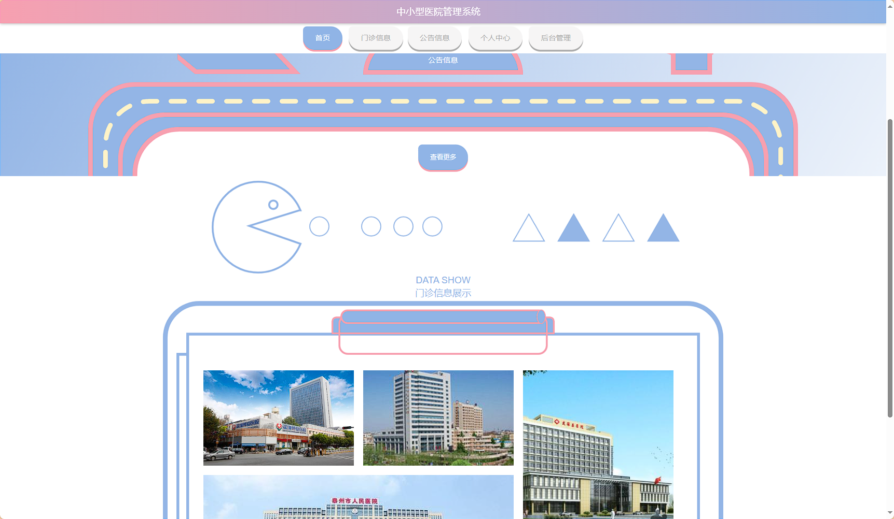
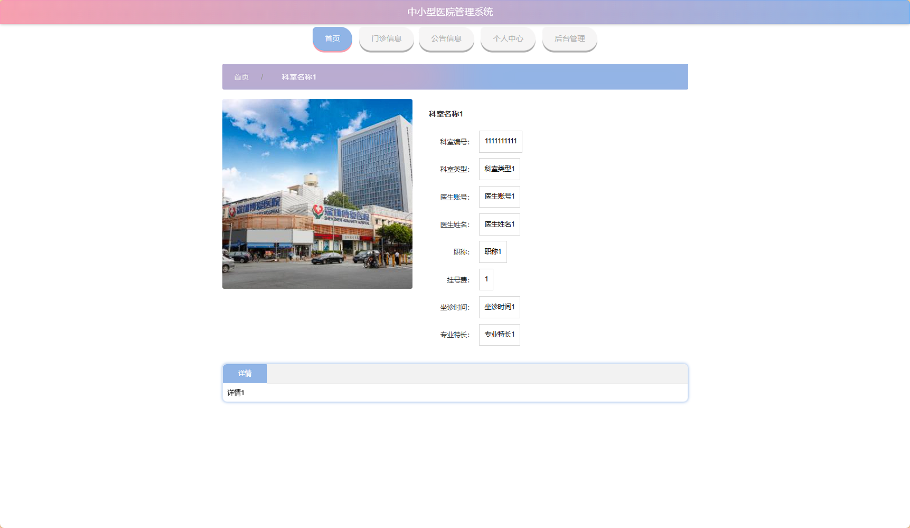
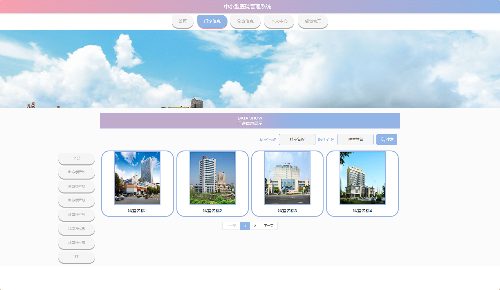
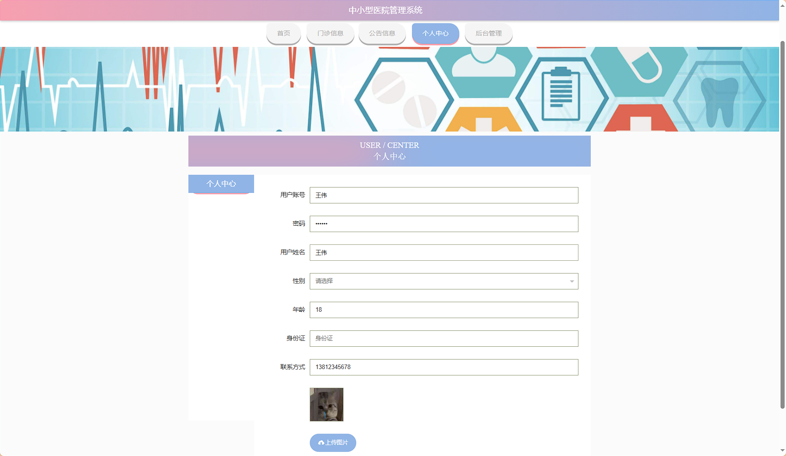

## 后台：
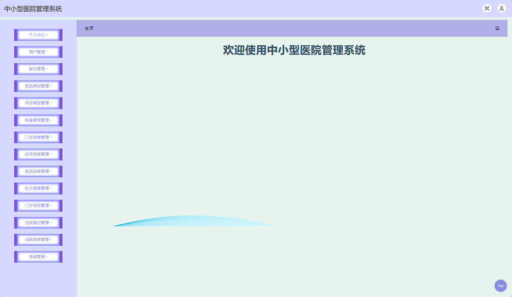
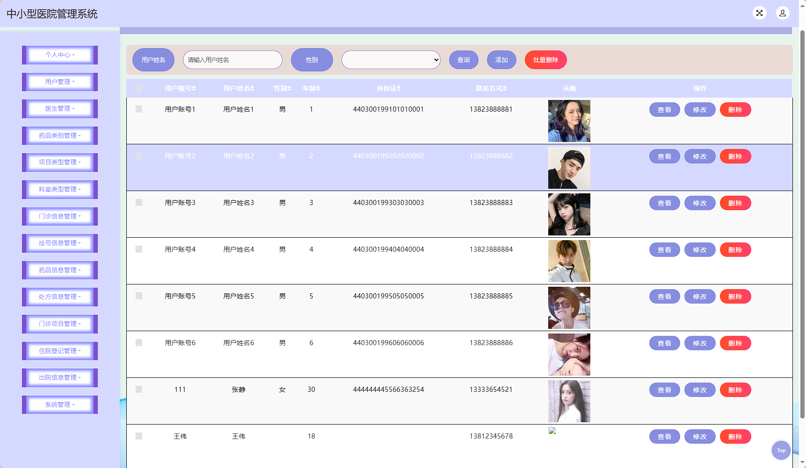
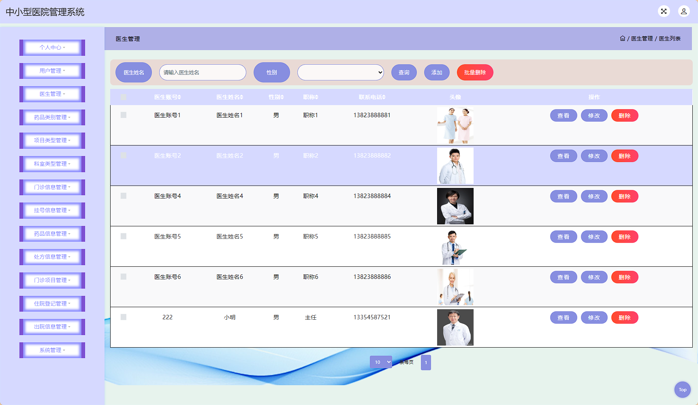
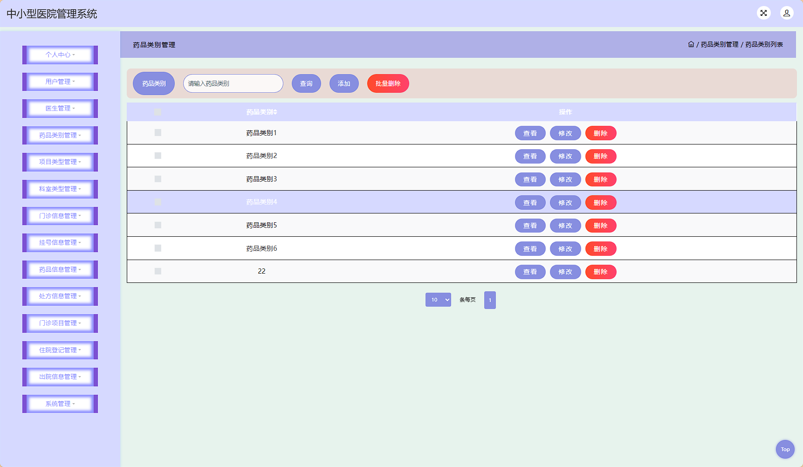
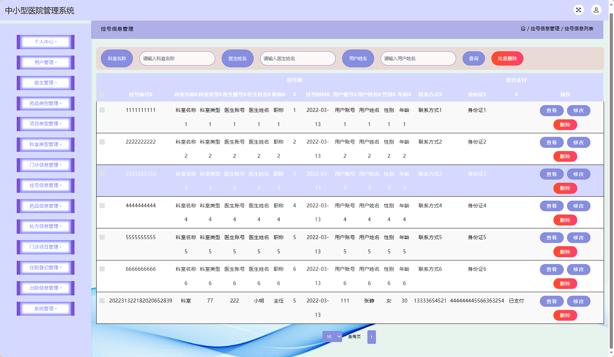
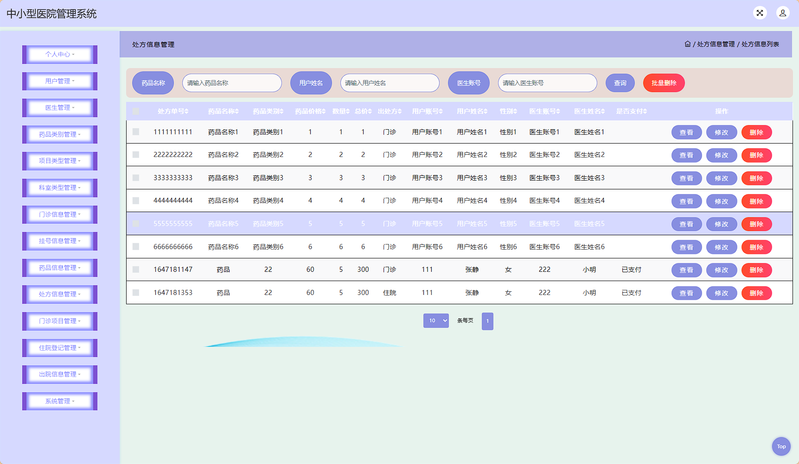
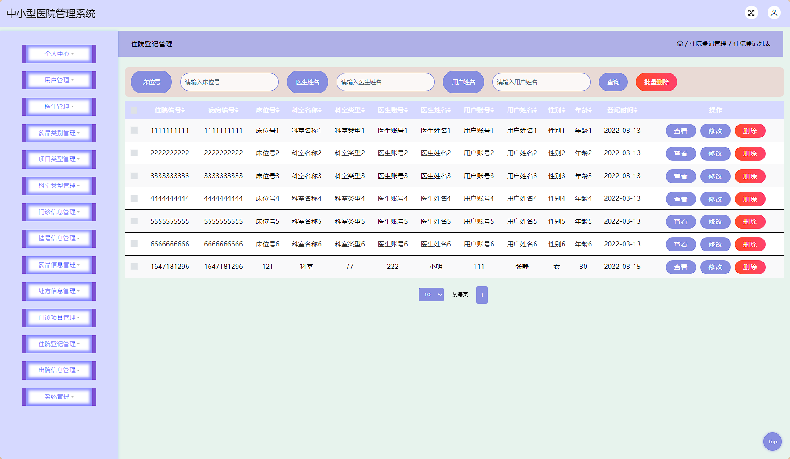

> 等等...

# 精选项目导航 & 快速部署工具
## 项目资源一站直达
- ​**访问项目导航站**：[点击进入](http://sysadmin.3vfree.vip)**快速检索所需项目名称**
- ​**技术栈全覆盖**：Java/SSm/Spring Boot/小程序等主流技术方案
- ​**配套资源**：每个项目均提供部署文档 + 演示视频（附效果截图）

### ▌导航站预览
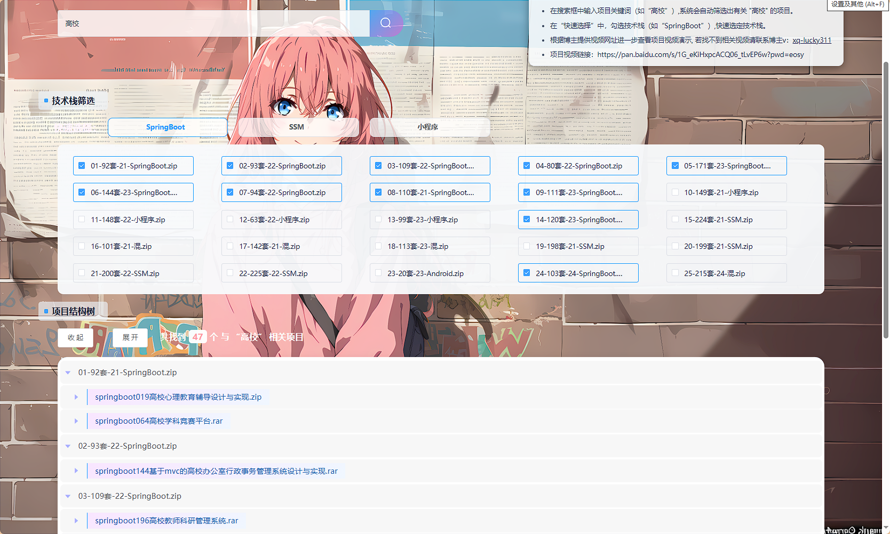

### ▌工具界面预览
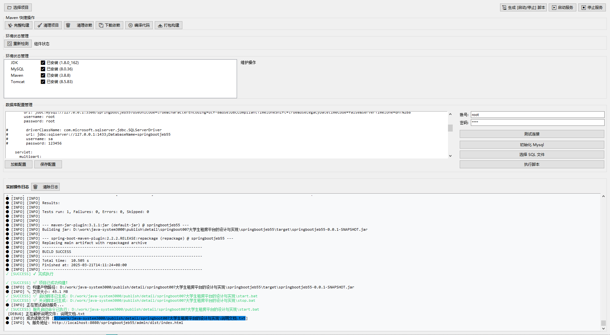

## 捐赠
> 博主将持续更新Java全栈开发项目，包含ssm，springboot，前后端分离系统等项目。
> 此外如果您够宽裕，请博主喝杯咖啡吧！捐赠将用于服务器维护与开源社区建设，感谢您的认可！
> 如需更多Java相关项目毕设3000+，有其他项目需求，sql文件等可联系博主v:xq-lucky311

---